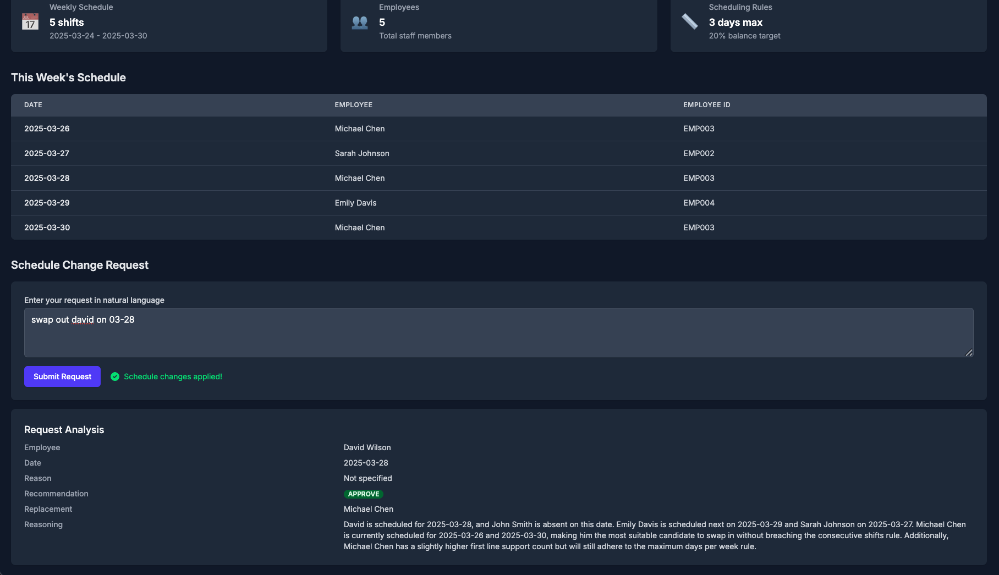
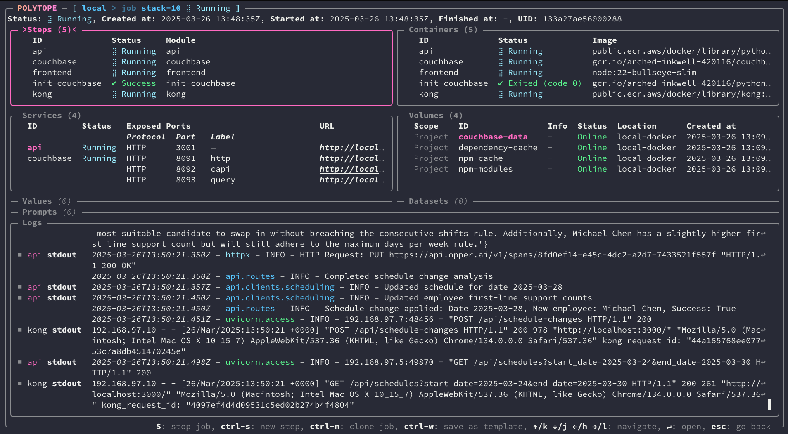

# Hackathon starter project: AI scheduling app

<div style="display: flex; justify-content: center; gap: 10px;">
  <a href="images/home.png">
    
  </a>
  <a href="images/polytope.png">
    
  </a>
</div>

This is a starter project for an LLM-based scheduling app, designed for you to get a running start on your Hackathon project.
It provides a simple interface for managing employee schedules using natural language and AI

Features:
- A complete API (written in Python) with persistent employee, schedule, and rules data, and LLM integration (courtesy of Opper).
- A frontend (written in React) that provides an interface for users to interact with the API.
- A portable dev env with hot reload (courtesy of Polytope) that makes it easy to iterate and collaborate on your solution. One command and you and all your team members are up and running with the same environment.

## Getting started

### TL;DR

0. Make sure you can run containers (on macOS we recommend [OrbStack](https://docs.orbstack.dev/install)).
1. Installed [Polytope](https://polytope.com/docs/quick-start#cli) (on macOS run `brew install polytopelabs/tap/polytope-cli`).
2. Clone this repo: `git clone https://github.com/aeriksson/hackathon-scheduling-starter.git my-project && cd my-project`
3. Go to [https://opper.ai/](https://opper.ai/) and get yourself an API key
4. Store the API key: `pt secret set opper-api-key YOUR_OPPER_API_KEY`
5. Run the stack: `pt run stack`
6. Open the UI: [http://localhost:8000](http://localhost:8000)
7. Start building something!

### Detailed instructions

#### Docker or OrbStack
You'll need Docker or OrbStack to run the app. You can install Docker from [here](https://docs.docker.com/get-docker/) and OrbStack from [here](https://docs.orbstack.dev/install).

#### Polytope CLI
On macOS:
```bash
brew install polytopelabs/tap/polytope-cli
```

For installation on Windows and Linux, see [the docs](https://polytope.com/docs/quick-start).

### Running the app
To run the app, clone this repository and navigate to the project directory:

```bash
git clone https://github.com/aeriksson/hackathon-scheduling-starter.git my-project
cd my-project
```

Next, sign up for [https://opper.ai/](https://opper.ai/) (it's free and gives you access to all the major LLMs - no credit card required!), create an API key, and store it using the Polytope CLI:
```bash
pt secret set opper-api-key YOUR_OPPER_API_KEY
```

Finally, run the following command to start the app:
```bash
pt run stack
```

Then open the UI at [http://localhost:8000](http://localhost:8000). On first load, this can take a little while to start up while dependencies are downloaded.

API documentation is automatically generated and can be found at [http://localhost:3000/redoc](http://localhost:3000/redoc).

## Project Structure

This app has two main components:
- [The API](./api) - A Python FastAPI backend that handles employee scheduling, schedule management, and Opper AI integration
- [The UI](./frontend) - A React TypeScript frontend that provides the user interface

The API follows a RESTful design with the following endpoints:

- `GET /api` - Basic health check
- `POST /api/employees` - Create a new employee
- `GET /api/employees` - Get all employees
- `GET /api/employees/{employee_number}` - Get an employee by employee number
- `PUT /api/employees/{employee_number}` - Update an employee
- `DELETE /api/employees/{employee_number}` - Delete an employee
- `POST /api/schedules` - Create a new schedule entry
- `GET /api/schedules` - Get all schedules with optional date range filtering
- `GET /api/schedules/{date}` - Get a schedule for a specific date
- `PUT /api/schedules/{date}` - Update a schedule for a specific date
- `DELETE /api/schedules/{date}` - Delete a schedule for a specific date
- `GET /api/rules` - Get the scheduling system rules
- `PUT /api/rules` - Update the scheduling system rules
- `POST /api/schedule-changes` - Process a natural language schedule change request

Example usage:

```bash
# Create a new employee
curl -X POST http://localhost:3000/api/employees -H "Content-Type: application/json" -d '{"name": "John Smith", "employee_number": "EMP001"}'

# Get all employees
curl http://localhost:3000/api/employees

# Create a schedule entry
curl -X POST http://localhost:3000/api/schedules -H "Content-Type: application/json" -d '{"date": "2024-04-01", "first_line_support": "EMP001"}'

# Process a natural language schedule change
curl -X POST http://localhost:3000/api/schedule-changes -H "Content-Type: application/json" -d '{"request_text": "John Smith needs time off on April 1st"}'
```

## About Polytope

This project uses [Polytope](https://polytope.com) to run and orchestrate all your services and automation.

Polytope is the easiest way to build, run, and iterate on your software. It gives you a unified interface for running all your services and workflows (CI, DataOps, MLOps, DevOps, ...) - on your machine, in the cloud or on-prem.

## About Opper AI

This template uses [Opper AI](https://opper.ai) for natural language schedule change request processing and AI-powered scheduling recommendations.

Learn more about the [Opper SDK on GitHub](https://github.com/opper-ai/opper-python) and in the [official documentation](https://docs.opper.ai/).
